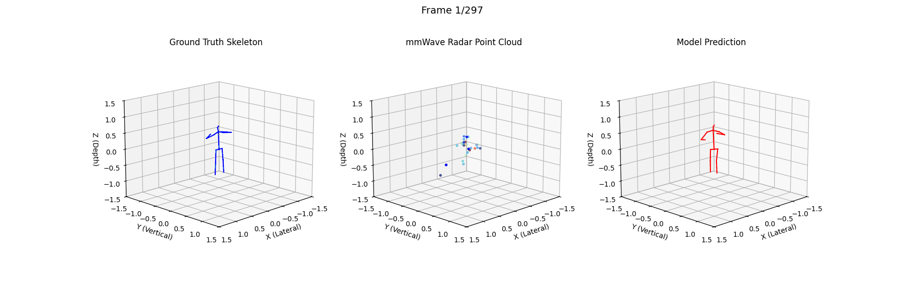

# RadarPose-HybridNet: End-to-End Activity Recognition Pipeline

This project implements a state-of-the-art Hybrid End-to-End Pipeline for Human Activity Recognition (HAR) using sparse mmWave radar point clouds. By unifying a Point Transformer for 3D pose estimation and a CTR-GCN for temporal action classification, the system achieves **95.79% overall accuracy** across 23 curated rehabilitation and daily living actions.

## Summary

Traditional mmWave HAR pipelines suffer from cascading errors when pose estimation and classification are treated as isolated steps. This repository provides:

- **Stage 1**: A spatial backbone (**Point Transformer**) that regresses 17-joint 3D skeletons with **51mm MPJPE**.
- **Stage 2**: A temporal classifier (**CTR-GCN**) utilizing channel-wise topology refinement.
- **Hybrid E2E**: A unified model that co-optimizes the backbone and classifier, allowing *"Task-Aware"* skeletal refinement and superior accuracy.

## Requirements

Install the dependencies listed in `requirements.txt`:

```
torch>=2.4
numpy
pandas
matplotlib
scipy
seaborn
scikit-learn
tqdm
```

## Installation & Usage

### 1. Data Setup

- Download the MMFi Dataset from the official source.
- Extract it into the `data/` folder.
- Ensure your `data/` directory contains the curated CSV:
  ```
  MMFi_action_segments_rmA1_2_3_6_len10to30.csv
  ```

### 2. Execution Workflow

#### Stage 1: Train Spatial Backbone
Train the Point Transformer first before either running stage 2 or hybrid stage files.
```bash
python stage1_train.py
```

#### Stage 2: Precompute Skeletons
Run the following script before training the sequential classifier:
```bash
python precompute_skeletons.py
```
then to train the stage 2 model
```bash
python stage2_train.py
```

#### Hybrid E2E: Full End-to-End Training
Train the joint model for refined pose estimation and classification:
```bash
python hybrid_train.py
```

#### Utils
Scripts in the `utils/` folder are modular. To run them, either move them to the root directory or ensure all local dependencies are copied into the `utils/` folder.

## Results & Visualization

### Stage 1: 3D Pose Estimation

The Point Transformer reconstructs high-fidelity skeletons from sparse point clouds.


### Hybrid Pipeline Performance

The hybrid model eliminates the performance ceiling of sequential training, reaching **95.79% accuracy**.



## Credits

- This work utilizes the MMFi Dataset  
  - [*Yang, J., et al. "MMFi: A Multi-Modal Non-Intrusive Corpus for Human Configuration Sensing." CVPR 2023.*](https://ntu-aiot-lab.github.io/mm-fi)

- Model architectures adapted from the official implementations below
  - [Point Transformer](https://arxiv.org/abs/2012.09164)
  - [CTR-GCN](https://arxiv.org/abs/2107.12213)

## License

**MIT License**.
